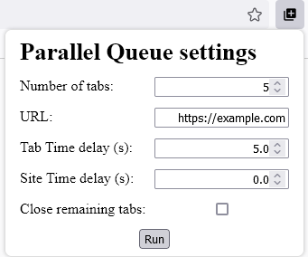

# Parallel Queue
A Firefox extension that allows you to open an arbitrary number of tabs, each one of them in a different container, pointing to an URL (most likely a certain GPU company's store). It will automatically select the first tab to load.

## How to use
1. (If not already installed) Install [Mozilla Firefox](https://www.mozilla.org/firefox)
2. Enable Container Tabs (Menu > Settings > General > Tabs)
3. Download extension from [releases page](../../releases) (zip file)
4. Install extension as temporary add-on
    1. Go to Menu > Addons and Themes > Settings Icon > Debug Add-ons
    2. Load Temporary Add-on...
    3. Select previously downloaded zip file and confirm
5. Click on extension logo in the toolbar (), configure and click "Run" 
6. Tabs will start to open. The first tab to enter the wanted URL will be selected and, if still possible, no more tabs will be opened.

## Configuration parameters description
Add-on settings comes prefilled with (configurable) default values. A short description of each field follows:

1. "Number of tabs" field let you choose the number of tabs that will be opened
2. "URL" field is the destination location of each tab
3. "Tab Time delay" field let you specify a delay, in seconds, between each tab opening; a proper delay might avoid you to complete too many captchas, but it's not always the case.
4. "Site Time delay" field allows you to specify a delay, in seconds, before actually loading of the destination URL. At this time, it servers no definite purpose but it could be useful in the future.
5. "Close remaining tabs" field let you choose wether or not close remaining tabs after a tab successfully reached its destination.